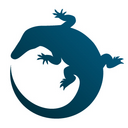
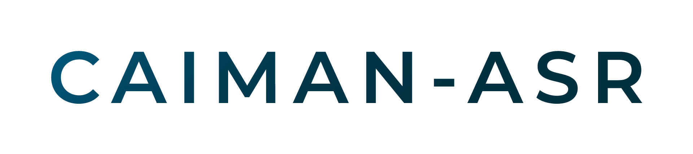

# CAIMAN-ASR 

CAIMAN-ASR is an Automatic Speech Recognition (ASR)
product designed to run on Myrtle.ai’s acceleration solutions for FPGA hardware.
The solution is designed for **low-latency realtime streaming ASR workloads**.

## See next

- Performance figures (Real-time streams, latency): [\[docs\]](https://caiman-asr.myrtle.ai/key_features.html#model-configurations) [\[markdown\]](docs/src/key_features.md#model-configurations)
- WERs: [\[docs\]](https://caiman-asr.myrtle.ai/key_features.html#word-error-rates-wers) [\[markdown\]](docs/src/key_features.md#word-error-rates-wers)
- Training speeds: [\[docs\]](https://caiman-asr.myrtle.ai/training/training_times.html) [\[markdown\]](docs/src/training/training_times.md)
- Getting started: [\[docs\]](https://caiman-asr.myrtle.ai/introduction.html) [\[markdown\]](docs/src/introduction.md)

