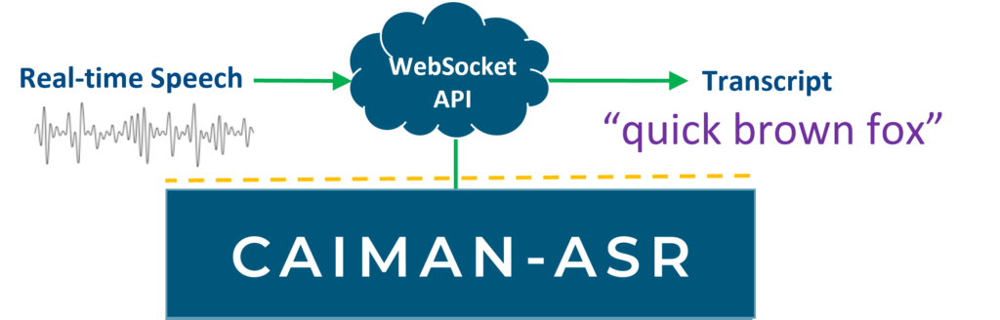

# Key Features

CAIMAN-ASR enables at-scale automatic speech recognition (ASR), supporting up to 2000 real-time streams per accelerator card.

## Lowest end-to-end latency

CAIMAN-ASR leverages the parallel processing advantages of Achronix’s Speedster7t® FPGA, the power behind the accelerator cards, to achieve extremely low latency inference. This enables NLP workloads to be performed in a human-like response time for end-to-end conversational AI.

## Simple to integrate into existing systems

CAIMAN-ASR's Websocket API can be easily connected to your service.

## Scale up rapidly & easily

CAIMAN-ASR runs on industry-standard PCIe accelerator cards, enabling existing racks to be upgraded quickly for up to 20x greater call capacity. The VectorPath® S7t-VG6 accelerator card from BittWare is available off-the-shelf today.

## Efficient inference, at scale

CAIMAN-ASR uses as much as 90% less energy to process the same number of real-time streams as an unaccelerated solution, significantly reducing energy costs and enhancing ESG (environmental, social, and governance) credentials.

## Streaming transcription

CAIMAN-ASR is provided pre-trained for English language transcription. For applications requiring specialist vocabularies or alternative languages, the neural model can easily be retrained with customers’ own bespoke datasets using the ML framework PyTorch.

## Model Configurations 

The solution supports two models: `base` and `large` of sizes 85M and 196M parameters respectively. These can be decoded with various configurations that trade off accuracy with latency and throughput. These trade-offs are described in more detail in the [performance page](./performance.md) but the 'fastest' and 'most accurate' configurations are summarized below:

| Description   | Model   | Parameters | Decoding      | Realtime streams (RTS) | p99 latency at max RTS  | p99 latency at RTS=32  | Huggingface Leaderboard WER  |
|---------------|---------|------------|---------------|------------------------|-------------------------|------------------------|------------------------------|
| fastest       | `base`  | 85M        | greedy        | 2000                   |   25 ms                 | 15 ms                  | 13.50%                       |
| most-accurate | `large` | 196M       | beam, width=4 | 500                    |   40 ms                 | 20 ms                  | 11.59%                       |

where:

- **Realtime streams (RTS)** is the number of concurrent streams that can be serviced by a single accelerator using default settings
- **p99 latency** is the 99th-percentile latency to process a single 60 ms audio frame and return any predictions. Note that latency increases with the number of concurrent streams.
- **WER** is the Word Error Rate, a measure of the accuracy of the model. Lower is better.
- **Huggingface Leaderboard WER** is the WER of the model on the [Huggingface Open ASR Leaderboard](https://huggingface.co/spaces/hf-audio/open_asr_leaderboard). WER is averaged across 8 test datasets.

The **solution scales linearly up to 8 accelerators, and a single server has been measured to support 16000 RTS** with the `base` model.
